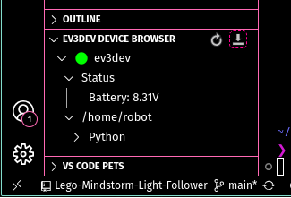

# Lego-Mindstorm-Light-Follower

## Description

This Demo implements a simple proportion controller on the Lego Mindstorm platform for both the NXT and EV3. This controller is using two light sensor as input and a motor ad output. The idea for this arrangment is tracking a light source by using the difference between the two sensors and rotating on its axis for tracking

## Construction

A very simple robot construction is used for demo purposes.
The robot, as can be seen in picture 1 to 3, consists of a baseplate that uses rubber wheels to resist slipping, a motor, that is connected to the baseplat and secured at the frame, the Lego mindsotmr controller itself and two, forward facing, light sensors.
By exectuing the program the robot now folloes a light source in a 2 dimensional plane. This is achives through a proportional-controller that takes both light snesors as input and outputs to the motor. To achive a good result the p-term needs to be adjusted based on experimenting with the available motor and light sensors.
A possible modification, to this configurating, would be adding a second axis of rotation to gain another degree of freedome.


## How to install

### NXT using NXC
Connect the turned on NXT Brick using USB.

I am using [Next Byte Code](https://bricxcc.sourceforge.net/nbc/) to compile and upload my code.

After installing NBC, for your respective operting system, run: 

```bash
nbc path_to_.nxc_file -d
```

If your NXT is turned on and connected, NBC should automatically upload your code.

### EV3 using Python

Connect the turned on EV3 Brick using USB 

install [EV3DEV-browser VS Code](https://marketplace.visualstudio.com/items?itemName=ev3dev.ev3dev-browser) Extension

Connect to the Brick using the menu it the bottom left by clicking on "Click here to connect"


If detected your EV3 should listed on the top of VSCode. Select it by clicking on it.


You EV3 should now be listed on the bottom left. You can see Battery status and the filesystem. You can upload your worksapce by pressing the button in the top right corner of the EV3DEV DEVICE BROWSER.



### EV3 using Rust

I recommend looking at the [EV3DEV lang rust](https://github.com/pixix4/ev3dev-lang-rust/blob/master/README.md) Github for more detailed instructions.

A small overview:


Install [rustup](https://rust-lang.org/tools/install/)

Install the `armv5te-musl` toolchain
```bash
rustup target add armv5te-unknown-linux-musleabi
```

Build binary from inside the "Rust" directory

```bash
cargo build --release
```

the executable is in ```Rust/target/arm5te-unknown-linux-musleabi/release``` and can be uploaded the same way as when using Python

### EV3 using C++

https://github.com/ddemidov/ev3dev-lang-cpp

## Credits

....

## License

...
